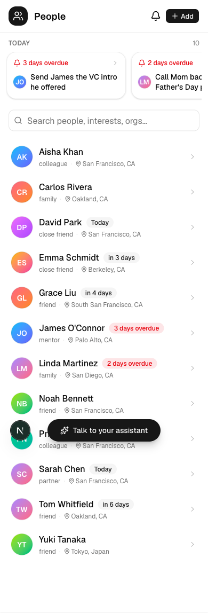
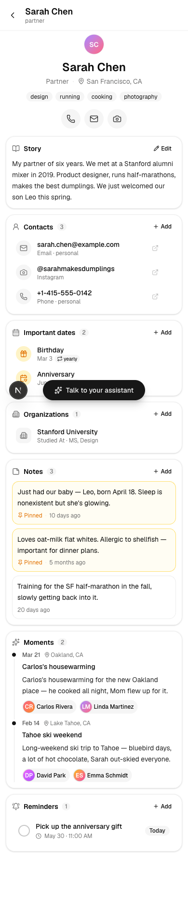
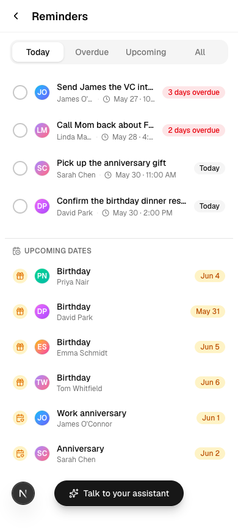

# PRM Voice

A mobile-first **Personal Relation Manager** — like a CRM, but for personal relationships. Remember details about the people in your life, nurture relationships, and recall what matters at the right moment.

The app is fully usable on its own. Connecting the **voice agent docked at the bottom** adds a hands-free layer that both manages your data (people, notes, dates, organizations, moments, reminders) and drives the app (navigate, answer "what's on screen").

> v1 is a live, open, no-login demo over a single shared world of seeded data.

<p align="center">
  
  
  
</p>

## Monorepo

- **`web/`** — Next.js (App Router) + shadcn/ui + Prisma. The standalone app and its CRUD API (the single data layer).
- **`server/`** — Python Pipecat voice agent (optional overlay): a main voice worker + an action/UI worker with 16 tools.
- **`docs/`** — design spec, research, and screenshots.

## Architecture (B)

A standalone Next.js app over Postgres that works **without** voice. The Pipecat voice agent is an optional overlay that calls the **same Next.js API** for data and drives the UI over RTVI (`navigate` / `refresh` / `highlight` / `toast`), while the client reports its current screen back so the agent can answer "what's on screen" and resolve "open the first one". One source of truth (the DB) → no desync.

## Stack

Next.js · shadcn/ui · Postgres (Supabase) · Pipecat · NVIDIA Parakeet (STT) · NVIDIA Nemotron (LLM) · Gradium (TTS) — with an OpenAI + Gradium fallback path.

## Status

- **Web app:** built and **verified end-to-end** against a live Postgres (migrate + seed + all three screens rendering the seeded world, 0 console errors).
- **Voice server:** builds and dry-constructs the full worker graph; needs live API keys + a mic for a real voice call.

## Get started

See **[`HANDOFF.md`](HANDOFF.md)** for local dev, the keys/accounts you need, and deploy steps (Vercel + Pipecat Cloud + Supabase).

```bash
docker compose up -d db
cd web && cp .env.example .env && pnpm install
pnpm exec prisma migrate deploy && pnpm run db:seed && pnpm dev   # → localhost:3000
```

## Docs

- **Design spec:** [`docs/superpowers/specs/2026-05-30-prm-voice-v1-design.md`](docs/superpowers/specs/2026-05-30-prm-voice-v1-design.md)
- **Research:** [`docs/research/`](docs/research/)
